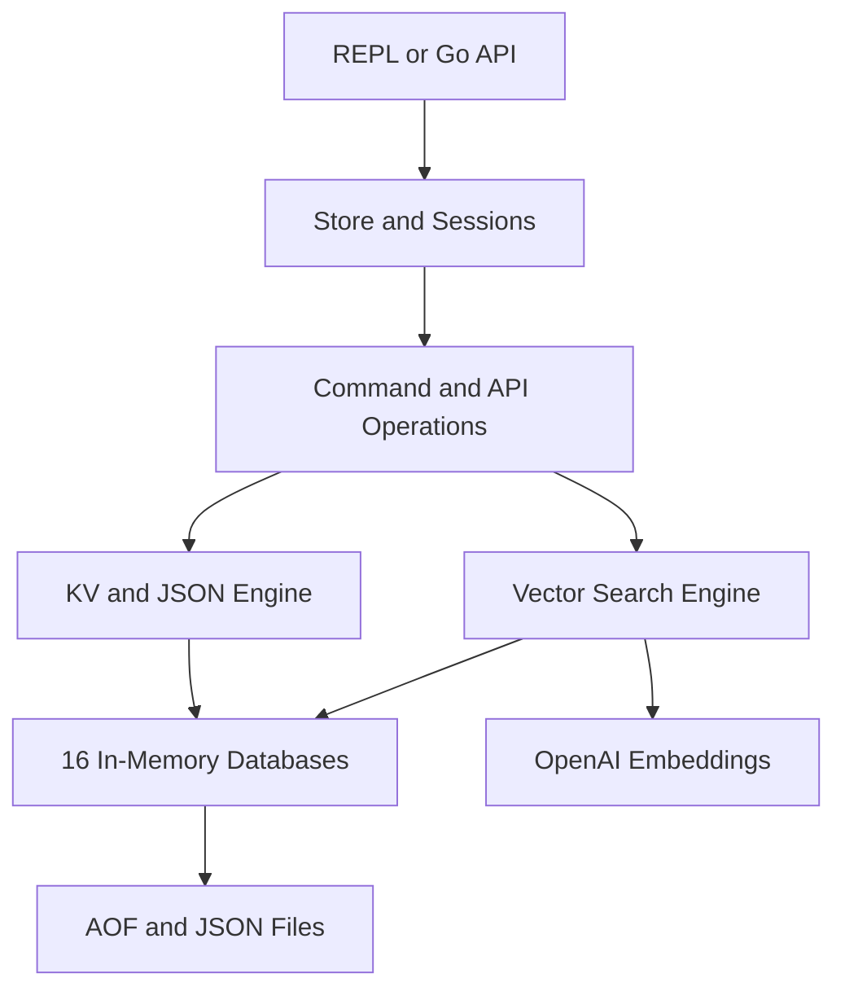

> [!NOTE]
> This README was generated by [SKILL](https://github.com/agenvoy/skill-readme-generate), get the ZH version from [here](./doc/README.zh.md).

***

<strong>EMBEDDED JSON KV STORAGE WITH REDIS-LIKE COMMANDS AND VECTOR SEARCH</strong>

***

> A Go embedded database with Redis-like commands, JSON document operations, and semantic vector search

## Table of Contents

- [Features](#features)
- [Architecture](#architecture)
- [License](#license)
- [Author](#author)

## Features

> `go get github.com/pardnchiu/toriidb` · [Documentation](./doc/doc.md)

- **Redis-Like Operations** — Use a familiar REPL through one command router or embed the same database directly through its Go API.
- **JSON Field Mutation** — Read, update, increment, and delete nested fields with dot notation instead of rewriting complete documents.
- **Layered Local Persistence** — Keep low-latency state in memory while preserving writes through AOF records and per-key JSON files.
- **Built-In Vector Search** — Attach embeddings to values and run top-K semantic search, pattern filtering, and cosine similarity queries.
- **Isolated Multi-Database State** — Work across 16 independently locked databases with lazy loading and session-scoped selection.

## Architecture

> [Full Architecture](./doc/architecture.md)

## License

This project is licensed under the [MIT LICENSE](LICENSE).

## Author

<h4 style="padding-top: 0">邱敬幃 Pardn Chiu</h4>

<a href="mailto:hi@pardn.io">hi@pardn.io</a> 
<a href="https://www.linkedin.com/in/pardnchiu">https://www.linkedin.com/in/pardnchiu</a>

***

©️ 2026 [邱敬幃 Pardn Chiu](https://www.linkedin.com/in/pardnchiu)
