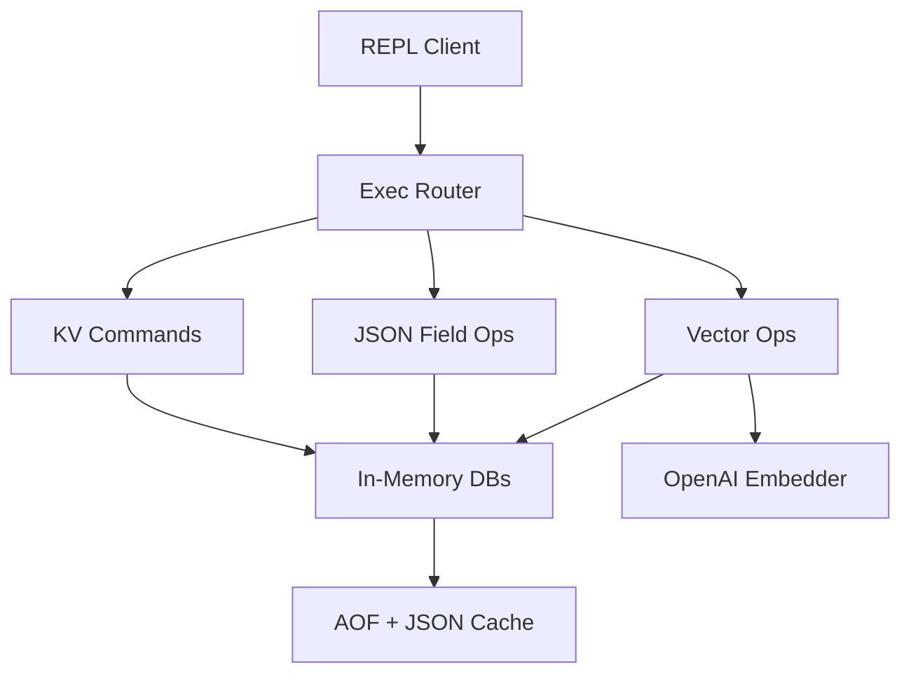

> [!NOTE]
> This README was generated by [SKILL](https://github.com/pardnchiu/skill-readme-generate), get the ZH version from [here](./doc/README.zh.md).

***

<strong>EMBEDDED JSON KV STORAGE WITH REDIS-LIKE COMMANDS AND VECTOR SEARCH</strong>

***

> A Go embedded database with Redis-like commands, JSON field operations, and semantic vector search

## Table of Contents

- [Features](#features)
- [Architecture](#architecture)
- [License](#license)
- [Author](#author)
- [Stars](#stars)

## Features

> `go get github.com/agenvoy/toriidb` · [Documentation](./doc/doc.md)

- **Redis-Like REPL** — Run familiar command-style workflows through a lightweight interactive shell built around a single command router.
- **JSON Field Mutation** — Read, update, increment, and delete nested document fields with dot-notation keys instead of rewriting full payloads.
- **Durable Local Storage** — Keep data in memory for speed while persisting every write through append-only logs and per-key JSON cache files.
- **Built-In Vector Search** — Attach embeddings to keys, cache them internally, and run semantic search and similarity queries from the same store.

## Architecture

> [Full Architecture](./doc/architecture.md)

## License

This project is licensed under the [MIT LICENSE](LICENSE).

## Author

<h4 style="padding-top: 0">邱敬幃 Pardn Chiu</h4>

<a href="mailto:hi@pardn.io">hi@pardn.io</a> 
<a href="https://www.linkedin.com/in/pardnchiu">https://www.linkedin.com/in/pardnchiu</a>

## Stars

***

©️ 2026 [邱敬幃 Pardn Chiu](https://www.linkedin.com/in/pardnchiu)
