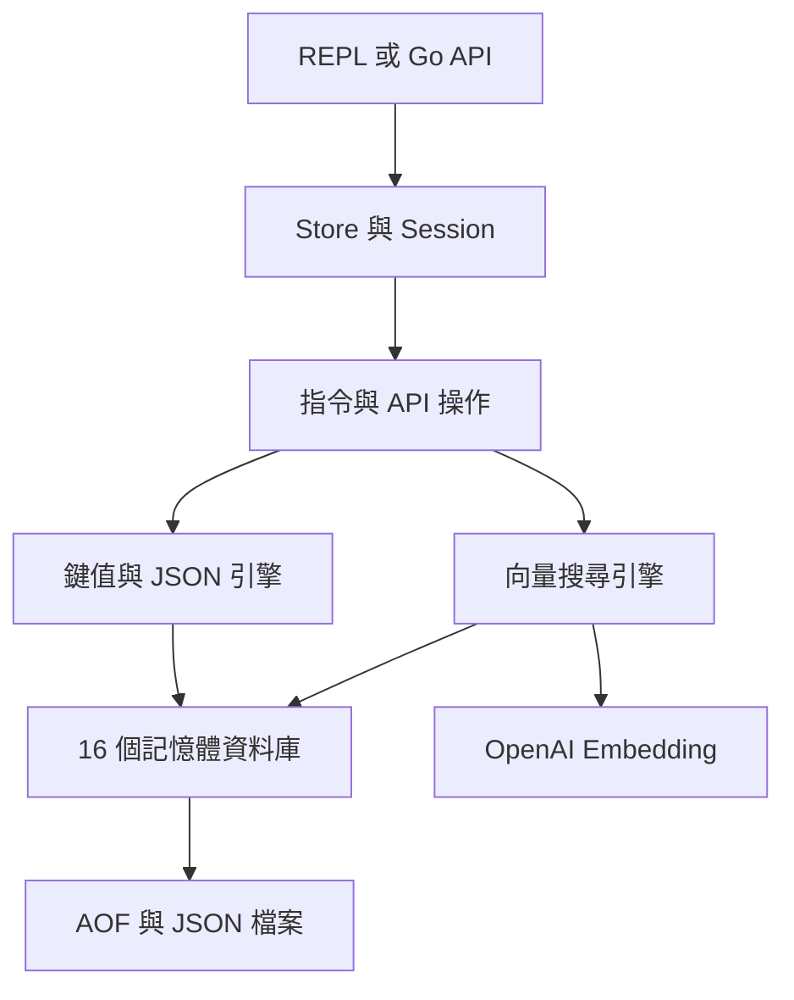

> [!NOTE]
> 此 README 由 [SKILL](https://github.com/agenvoy/skill-readme-generate) 生成，英文版請參閱 [這裡](../README.md)。

***

<strong>EMBEDDED JSON KV STORAGE WITH REDIS-LIKE COMMANDS AND VECTOR SEARCH</strong>

***

> Go 內嵌式資料庫，具備 Redis 風格指令、JSON 文件操作與語意向量搜尋

## 目錄

- [功能特點](#功能特點)
- [架構](#架構)
- [授權](#授權)
- [Author](#author)

## 功能特點

> `go get github.com/pardnchiu/toriidb` · [完整文件](./doc.zh.md)

- **Redis 風格操作** — 透過單一指令路由器提供熟悉的 REPL 工作流程，也能直接使用 Go API 嵌入應用程式。
- **JSON 欄位增修** — 使用點記法讀取、更新、遞增或刪除巢狀欄位，無需重寫整份文件。
- **分層本地持久化** — 以記憶體維持低延遲，並透過 AOF 與逐鍵 JSON 檔案保存每次寫入。
- **內建向量搜尋** — 為鍵值附加 embedding，支援 Top-K 語意搜尋、樣式過濾與餘弦相似度比較。
- **多資料庫並行隔離** — 提供 16 個各自具備鎖與延遲載入生命週期的獨立資料庫空間。

## 架構

> [完整架構](./architecture.zh.md)

## 授權

本專案採用 [MIT LICENSE](../LICENSE)。

## Author

<h4 style="padding-top: 0">邱敬幃 Pardn Chiu</h4>

<a href="mailto:hi@pardn.io">hi@pardn.io</a> 
<a href="https://www.linkedin.com/in/pardnchiu">https://www.linkedin.com/in/pardnchiu</a>

***

©️ 2026 [邱敬幃 Pardn Chiu](https://www.linkedin.com/in/pardnchiu)
