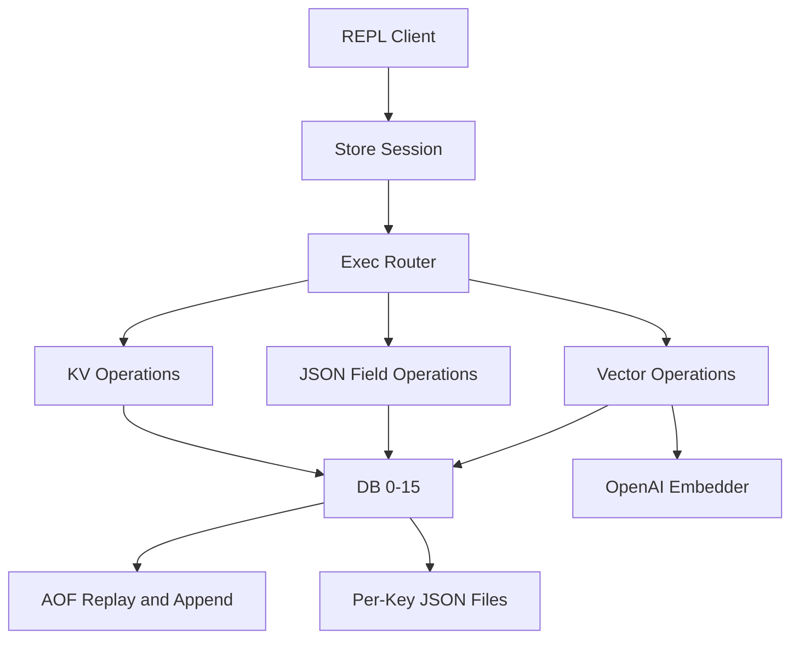
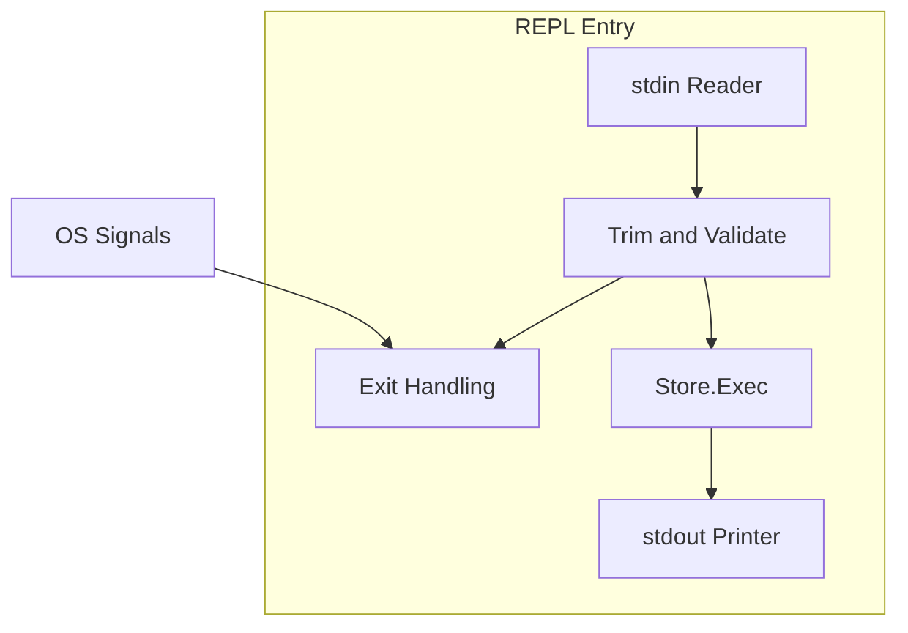
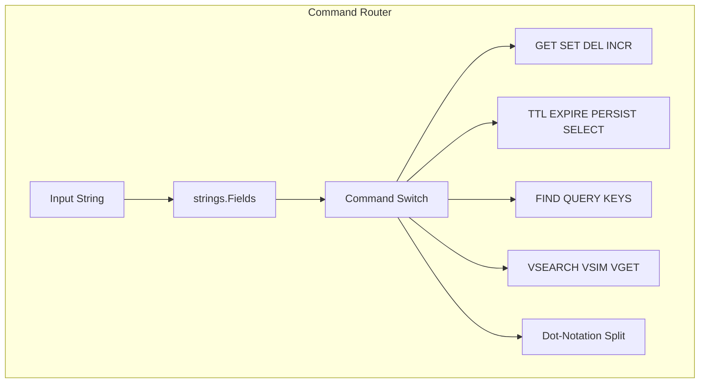
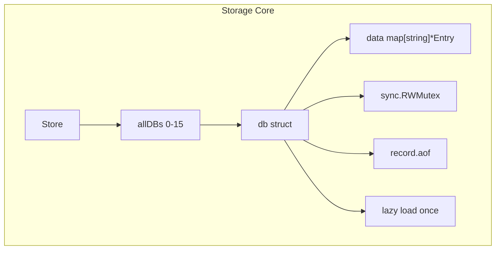
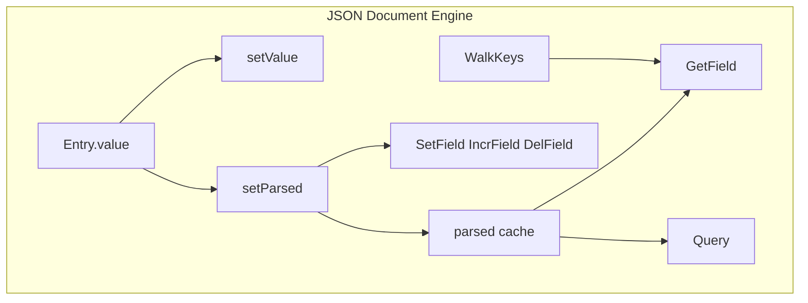
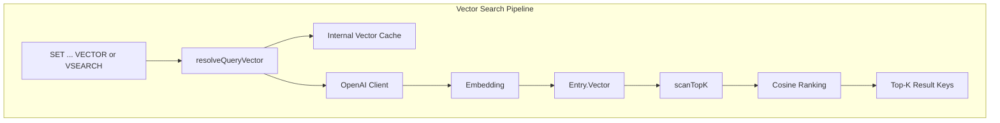
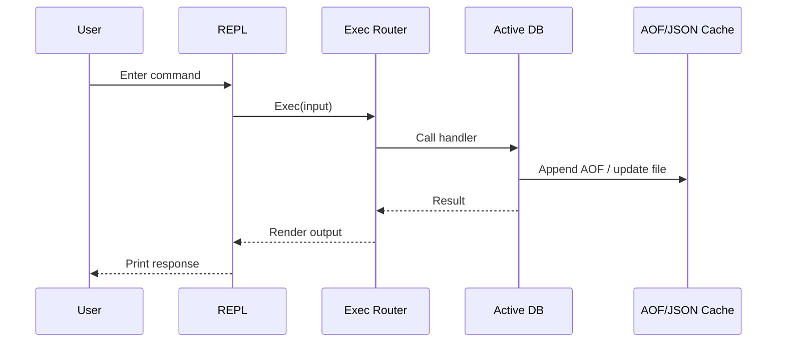
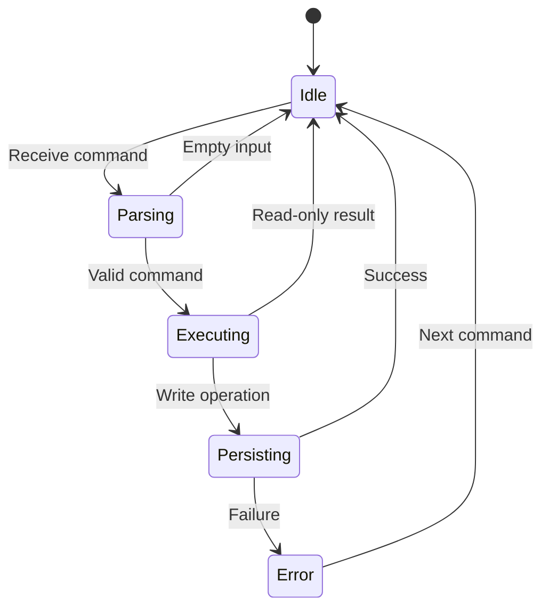

# toriidb - Architecture

> Back to [README](../README.md)

## Overview

## Module: REPL Entry

The command-line test client reads user input, prints prompts, and forwards each command to the store session.

## Module: Command Router

The router parses command tokens and dispatches them to key-value, JSON, TTL, query, and vector handlers.

## Module: Storage Core

The storage core maintains sixteen databases, each with its own lock, in-memory map, AOF file, and lazy-loading lifecycle.

## Module: JSON Document Engine

Document helpers keep raw string values and parsed JSON cache synchronized while supporting nested field mutation.

## Module: Vector Search Pipeline

Vector features embed text, cache query vectors internally, and score candidate entries with cosine similarity.

## Data Flow

## State Machine

***

©️ 2026 [邱敬幃 Pardn Chiu](https://www.linkedin.com/in/pardnchiu)
