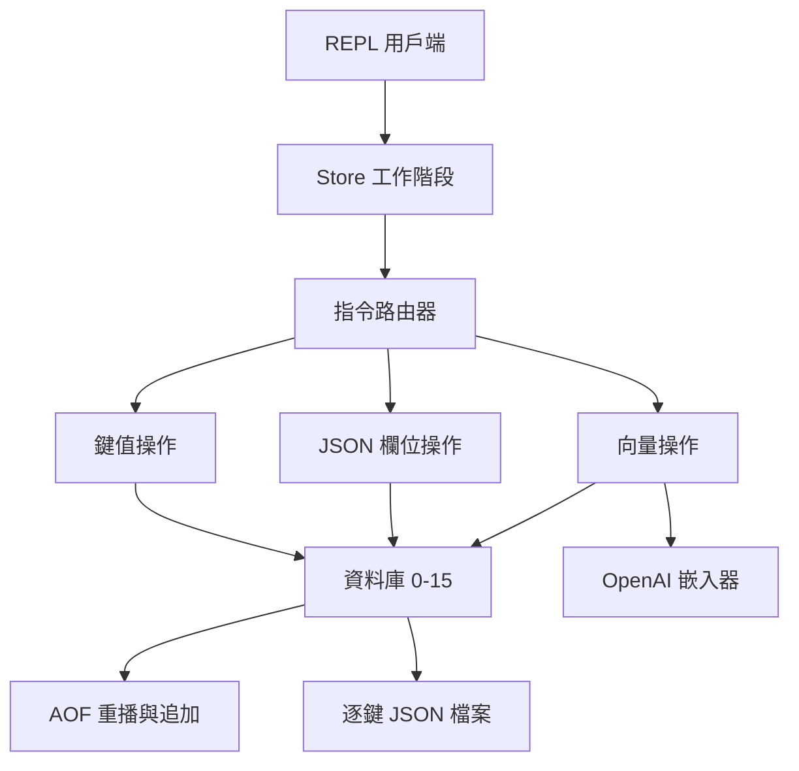
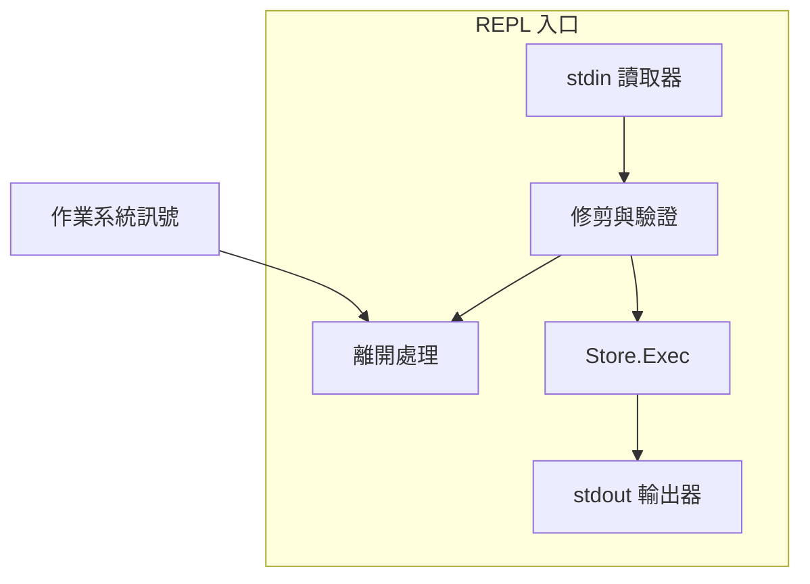
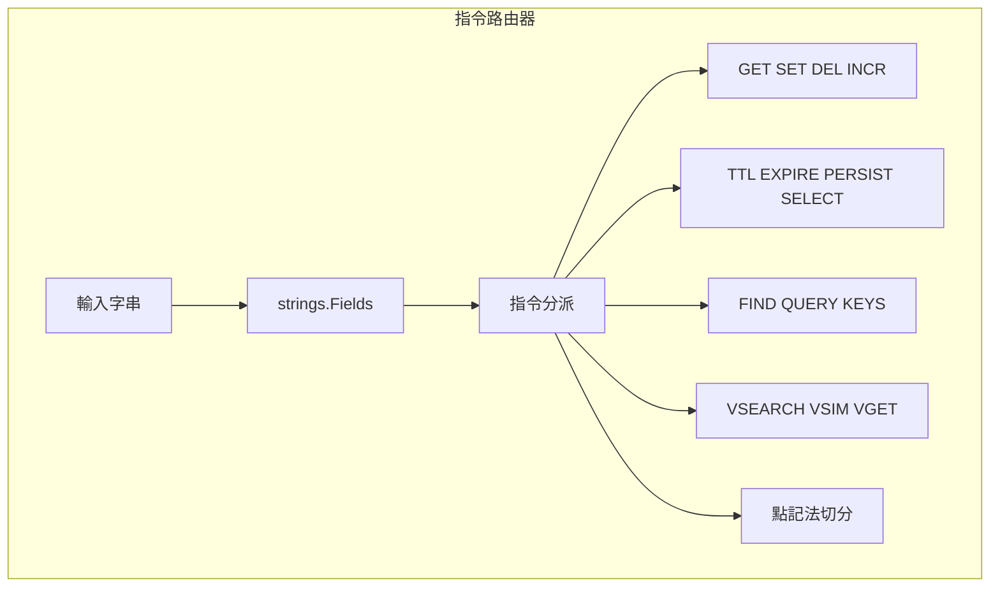
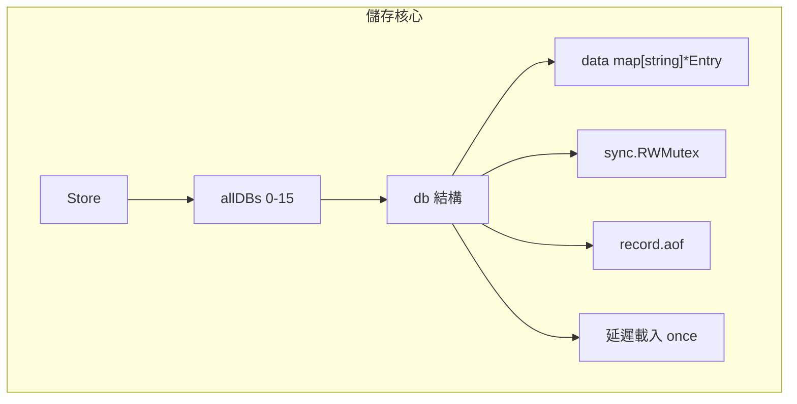
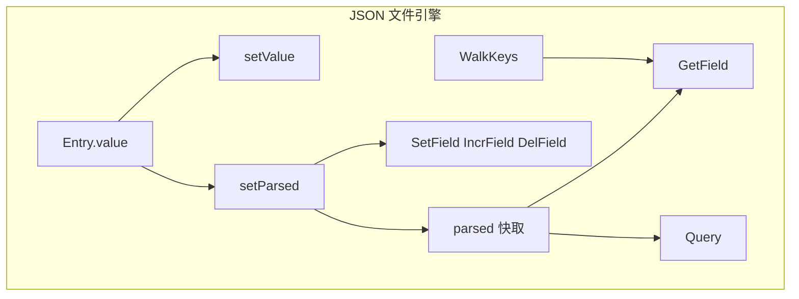
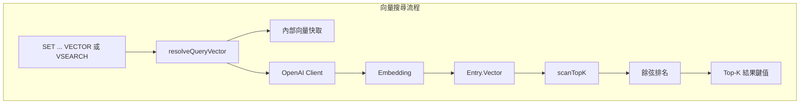
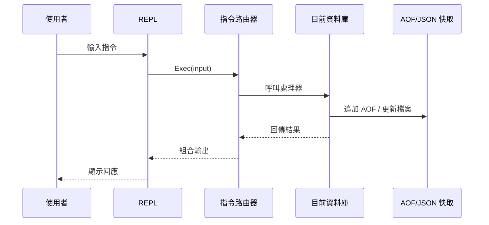
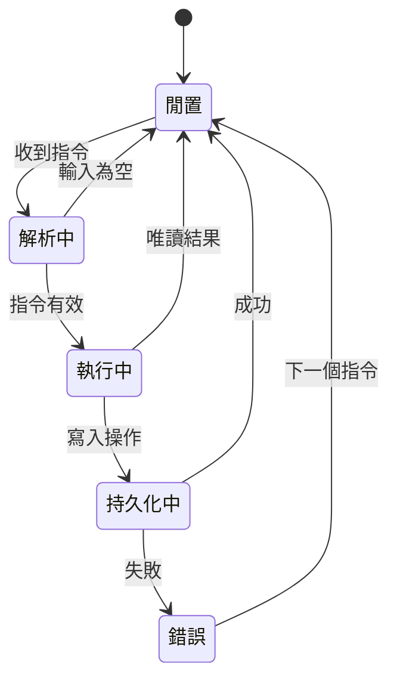

# toriidb - 架構

> 返回 [README](./README.zh.md)

## 概覽

## Module: REPL Entry

命令列測試客戶端負責讀取使用者輸入、顯示提示字元，並把每一條指令送到 store session。

## Module: Command Router

路由器會解析指令 token，並分派到鍵值、JSON、TTL、查詢與向量處理流程。

## Module: Storage Core

儲存核心維護 16 個資料庫，每個資料庫都有自己的鎖、記憶體 map、AOF 檔案與延遲載入生命週期。

## Module: JSON Document Engine

文件輔助流程會同步維持原始字串值與解析後的 JSON 快取，並支援巢狀欄位增修。

## Module: Vector Search Pipeline

向量功能會嵌入文字、把查詢向量快取在內部，並以餘弦相似度為候選 entry 排名。

## 資料流

## 狀態機

***

©️ 2026 [邱敬幃 Pardn Chiu](https://www.linkedin.com/in/pardnchiu)
